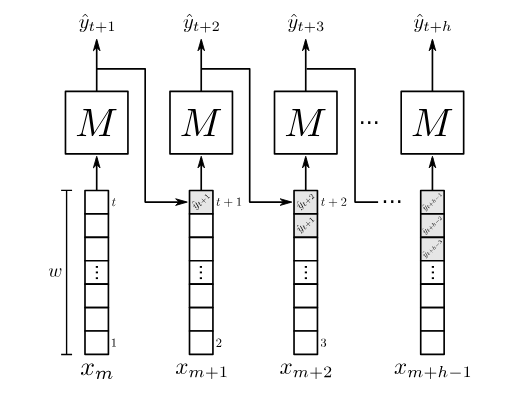

### [O impacto do tamanho da janela na previsão univariada de séries temporais usando aprendizado de máquina](../docs/Artigo%2001%20-%20Series%20Temporais.pdf)

##### Indrodução

* Fala sobre a importância das séries teemporais na economia, saúde, engenharia e etc.
* Podemos definir séries temporais como uma sequência de termos ordenados ao longo do tempo, com intervalos regulares
* Encontrar informações ocultas e prever comportamentos
* Importância do tamanho da janela se dá pois esse hiperparâmetro define a quantidade de unidades dee tempo que estarão presentes em cada modelo, influenciando na precisão e previsão
* Por fim os autores relatam que o artigo vai discorrer sobre o real impacto do tamanho da janela na previsão de séries temporais, utilizando diferentes modelos
* Utilizaram duas bases de dados (Varejo e mobilidade urbana) - 20 séries temporais
* Algoritmos utilizados: Baggigng, Boosting, Stacking e uma Reede Neural Recorrente

##### Estado da Arte

* Inicialmente relata as tarefas que podem ser realizadas utilizando séries temporais: Detecção de anomalia, clusterização, classificação, segmentação e previsão
* Os artigos utilizados como referencia englobam os seguintes aspectos:
  * O primeiro de [Huber andStuckenschmidt 2020] analisou a previsão de produtos do varejo, com o adicional de **datas especiais** e feriados.
  * [Abolghasemi et al. 2020] modelo dele está relacionado a demanda por produtos, levando em consideração eventos sistemáticos (promoção)
  * [Cheng et  al. 2006], as previsões de longo prazo tendem a ter maiores erros, pois o viés e a variância das previsões passadas afetam as previsõesfuturas, resultando em um erro acumulado
  * **[Shynkevich et al. 2017] testaram a combinação do horizonte de previsão e do tamanho da janela utilizando três modelos. Os resultados indicaram que o tamanho ideal da janela é próximo do tamanho do horizonte de previsão.**
  * [Bergström and Hjelm 2019] estudaram o efeito do tamanho da janela na previsão do índice da bolsa americana S&P500 utilizandoLSTMe descobriram que o tamanho ótimo da janela é de dez dias.

##### Metodologia

Foram utilizados dos conjuntos de dados: um de embarques em linhas de ônibus e um de vendas de produtos de varejo. Os autores pretendem com esses dados, serem capazes de prever a quantidade de embarques  e de vendas.

1. **Conjunto de Dados**
   1. A base de vendas são de uma varejista, do setor de supermecardos, 20 produtos que mais contribuiam com o faturamento da loja. Período (02/01/2017 - 30/04/2019). De 01/2017 - 12/2018 foram utilizados para treino e de 01/2019 - 04/2019 foram para testes.
   2. A outra base de dados que se refere ao número de embarques e desembarques de passageiros nas 20 linhas de maior uso em Fortaleza. Período de 01/2018 - 07/2018.
2. **Modelagem e Treinamento de Modelos**
   1. Utilizaram janela deslizante, que trata-se de uma abordagem em que o dado da série temporal é dividido em segmentos menores e de tamanho constante (w). Com dslocamento para a direita e aplicando pesos.
   2. As janelas deslizantes foi um artifício encontrado pelos autores que permitiu com que eles pudessem transformar séries temporais em um conjunto de dados rotúlados
   3. Pelo que eu entendi, você tem um perído w de dias, meio que "clusterizou" o w, afim de se obter caracteriscas semelhantes, nisso você tem uma janela w, o dia após a janela representa a janela que se quer prever
3. **Previsão Múltiplos Passos à Frente**
   1. O processo de inferência em séries temporais múltiplos passos à frente consiste em prever os próximos h valores no futuro. Temos algumas abordagens que realizam isso: Iterativa, Direta, MIMO (Multiple INput e Multiple Output) ou combinações.
   2. Os autores utilizaram a aIterativa pois para estimar os valores futuros faz-se uma previsão por vez
      
   3. Avaliou-se os resultados utilizando o Erro Percentual Médio Simétrico (SMAPE), que foi escolhido por ser um erro percentual. Por ser também um erro geométrico é ideal para comparar o desempenho de múltiplos modelos

##### Resultados e Discussão

* Foram reealizadas previsões em 40 séries temporais
* Em ambos os conjuntos de dados, foi possível observar um impacto positivo nas previsões ao au-mentar o tamanho da janela. Após um determinado tamanho dew, o erro se mantém constante.No entanto, é importante ponderar se vale a pena usar tamanhos de janela muito maiores, uma vezque o aumento do tamanho da janela também aumenta o tamanho dos dados de entrada e, conse-quentemente, o tempo de treinamento dos modelos.

##### Conclusão

* Primeiramente, observou-se que aumentar o tamanho da janela pode levar a melhorias nosvalores das métricas de avaliação até um ponto de estabilização.
* Redes Neurais Recorrentes não superaramos modelosensembleem diversos cenários de previsão de séries temporais univariáveis.
*
